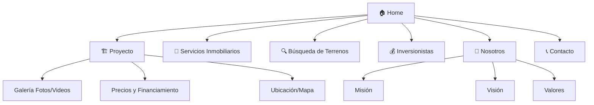

# 🏗️ Plan de Arquitectura — Sitio Web Inmobiliario

> Evaluado y corregido por un Arquitecto de Software Senior.

---

## 1. Evaluación del Plan Original

El plan anterior tenía debilidades importantes:

| Problema | Impacto |
|---|---|
| No define stack tecnológico concreto | Imposible estimar tiempos ni costos |
| Mezcla páginas con secciones (servicios, terrenos, inversionistas como bullets) | Confusión en navegación y SEO pobre |
| No separa frontend de backend/integraciones | Riesgo de acoplamiento y deuda técnica |
| Falta estrategia de conversión (CTA, funnels) | El sitio no generará leads efectivos |
| No menciona analytics ni tracking | Sin métricas = sin mejora continua |
| Galería y videos sin estrategia de carga | Sitio lento = abandono del usuario |
| No define entornos (dev/staging/prod) | Riesgo de publicar errores en producción |

---

## 2. Arquitectura de Información (Sitemap Corregido)



### Páginas Principales (6 rutas independientes)

| # | Ruta | Página | Propósito |
|---|---|---|---|
| 1 | `/` | **Home** | Landing principal, hero del proyecto, CTA de conversión |
| 2 | `/proyecto` | **El Proyecto** | Detalle completo: galería, precios, financiamiento, mapa |
| 3 | `/servicios` | **Servicios Inmobiliarios** | Asesoría, compra/venta, administración de propiedades |
| 4 | `/terrenos` | **Búsqueda de Terrenos** | Catálogo filtrable de terrenos disponibles |
| 5 | `/inversionistas` | **Inversionistas** | ROI, oportunidades, formulario exclusivo para inversores |
| 6 | `/nosotros` | **Nosotros** | Misión, Visión, Valores, equipo |

### Componentes Transversales (presentes en todas las páginas)

| Componente | Ubicación | Detalle |
|---|---|---|
| **Navbar** | Top fijo | Logo + menú hamburguesa mobile + CTA "Contáctanos" |
| **Footer** | Bottom | Redes sociales, mapa del sitio, datos legales, formulario rápido |
| **WhatsApp Floating** | Bottom-right | Botón flotante siempre visible |
| **Formulario de Contacto** | Sección + modal | Formulario completo en `/contacto` + modal accesible desde cualquier CTA |
| **Barra de Redes Sociales** | Footer + sidebar mobile | Facebook, Instagram, TikTok, YouTube, LinkedIn |

---

## 3. Stack Tecnológico Recomendado

| Capa | Tecnología | Justificación |
|---|---|---|
| **Framework** | **Astro 5.x** | SSG/SSR, rendimiento superior, ideal para sitios con contenido estático/mixto |
| **UI Components** | Astro Islands + vanilla JS | Hidratación parcial, cero JS innecesario |
| **Estilos** | CSS custom properties + módulos | Sin dependencias, máximo control, fácil tematización |
| **Galería** | Lightbox (glightbox o similar) | Experiencia premium para fotos y videos |
| **Mapas** | Google Maps Embed API o Leaflet | Ubicación del proyecto |
| **Formularios** | Astro Actions o API Route → Email | Sin backend externo, envía a correo corporativo |
| **Hosting** | **Vercel** (Edge) | Deploy automático desde GitHub, SSL incluido, CDN global |
| **Dominio** | Registrar `.com` o `.com.pe` | Namecheap, Cloudflare, o GoDaddy |
| **Email corporativo** | Zoho Mail (gratis) o Google Workspace | `contacto@tudominio.com` |
| **Analytics** | Vercel Analytics + Google Analytics 4 | Métricas de rendimiento y comportamiento de usuario |
| **SEO** | astro-seo + Schema.org RealEstateListing | Meta tags automáticos + datos estructurados |
| **Imágenes** | Astro `<Image>` + formato WebP/AVIF | Optimización automática, lazy loading nativo |
| **Videos** | YouTube/Vimeo embed con facade pattern | Carga diferida: muestra thumbnail, carga iframe al click |

---

## 4. Detalle por Página

### 4.1 Home (`/`)
- **Hero**: Video de fondo o imagen de alta resolución con overlay + titular + CTA principal
- **Resumen del Proyecto**: Card con foto, precio desde, botón "Ver más"
- **Servicios Destacados**: 3 cards con iconos (Servicios, Terrenos, Inversiones)
- **Contador animado**: Lotes vendidos, m² desarrollados, inversionistas
- **Testimonios**: Carousel con reseñas de clientes (si existen)
- **CTA Final**: "¿Listo para invertir?" → Formulario o WhatsApp

### 4.2 Proyecto (`/proyecto`)
- **Galería interactiva**: Grid de fotos + lightbox + videos embebidos
- **Tabla de precios**: Lotes/unidades con m², precio, estado (disponible/reservado/vendido)
- **Financiamiento**: Planes de pago, cuota inicial, simulador si es posible
- **Mapa de ubicación**: Google Maps embed con pin del proyecto
- **Documentos descargables**: Brochure PDF, planos

### 4.3 Servicios Inmobiliarios (`/servicios`)
- Cards con cada servicio ofrecido
- CTA por servicio → formulario de contacto pre-llenado

### 4.4 Búsqueda de Terrenos (`/terrenos`)
- Catálogo con filtros (ubicación, precio, m²)
- Card por terreno con foto, precio, y botón de contacto

### 4.5 Inversionistas (`/inversionistas`)
- Propuesta de valor para inversores
- Datos de rentabilidad / ROI
- Formulario exclusivo para inversores (campos adicionales: monto a invertir, perfil)

### 4.6 Nosotros (`/nosotros`)
- Sección Misión / Visión / Valores con diseño visual (iconos o ilustraciones)
- Historia de la empresa (timeline opcional)
- Equipo directivo (fotos + roles)

---

## 5. SEO y Performance

| Aspecto | Implementación |
|---|---|
| Meta tags | `astro-seo`: título, descripción, og:image por página |
| Schema.org | `RealEstateListing` para el proyecto, `Organization` para la empresa |
| Sitemap | `@astrojs/sitemap` (generación automática) |
| Robots.txt | Generado automáticamente |
| Core Web Vitals | LCP < 2.5s, CLS < 0.1 (Astro lo facilita con SSG) |
| Imágenes | Formato WebP/AVIF, lazy loading, tamaños responsive |
| Videos | Facade pattern (thumbnail → iframe on click) |
| SSL/HTTPS | Incluido con Vercel (certificado automático) |
| Canonical URLs | Configuradas por página |

---

## 6. Infraestructura y Entornos

```
┌─────────────┐     ┌──────────────┐     ┌──────────────┐
│  Desarrollo │────▶│   Staging     │────▶│  Producción   │
│  (local)    │     │  (preview)    │     │  (vercel.app) │
│  localhost   │     │  branch PRs   │     │  tudominio.com│
└─────────────┘     └──────────────┘     └──────────────┘
```

- **GitHub**: Repositorio con ramas `main` (prod) y `develop` (staging)
- **Vercel**: Deploy automático por push. Preview deploys por Pull Request.
- **Dominio**: Conectar dominio personalizado en Vercel (DNS)
- **Email**: Configurar MX records del dominio para Zoho/Google Workspace

---

## 7. Checklist de Entregables

| # | Entregable | Estado |
|---|---|---|
| 1 | Diseño UX/UI (mockups o directo en código) | ⬜ Pendiente |
| 2 | Desarrollo Home | ⬜ Pendiente |
| 3 | Desarrollo página Proyecto + Galería | ⬜ Pendiente |
| 4 | Desarrollo página Servicios | ⬜ Pendiente |
| 5 | Desarrollo página Terrenos | ⬜ Pendiente |
| 6 | Desarrollo página Inversionistas | ⬜ Pendiente |
| 7 | Desarrollo página Nosotros | ⬜ Pendiente |
| 8 | Formulario de contacto + envío de emails | ⬜ Pendiente |
| 9 | Integración redes sociales + WhatsApp | ⬜ Pendiente |
| 10 | SEO completo (meta tags, schema, sitemap) | ⬜ Pendiente |
| 11 | Registro de dominio + SSL | ⬜ Pendiente |
| 12 | Configuración email corporativo | ⬜ Pendiente |
| 13 | Deploy a producción | ⬜ Pendiente |
| 14 | Analytics (Vercel + GA4) | ⬜ Pendiente |

---

## 8. Preguntas Clave Antes de Iniciar

> [!IMPORTANT]
> Necesito que me confirmes lo siguiente para poder arrancar:
> 1. **¿Ya tienes logo y colores de marca?** Si no, puedo proponerte una paleta profesional.
> 2. **¿Nombre del proyecto inmobiliario?** Para configurar dominio y branding.
> 3. **¿Tienes fotos/videos del proyecto?** O necesitas imágenes placeholder por ahora.
> 4. **¿Tienes los precios y planes de financiamiento definidos?**
> 5. **¿Qué redes sociales tiene la inmobiliaria?** (links exactos)
> 6. **¿Prefieres que el formulario envíe a un correo o a un CRM como HubSpot?**
> 7. **¿Ya tienes dominio registrado?** Si no, ¿cuál nombre prefieres?
